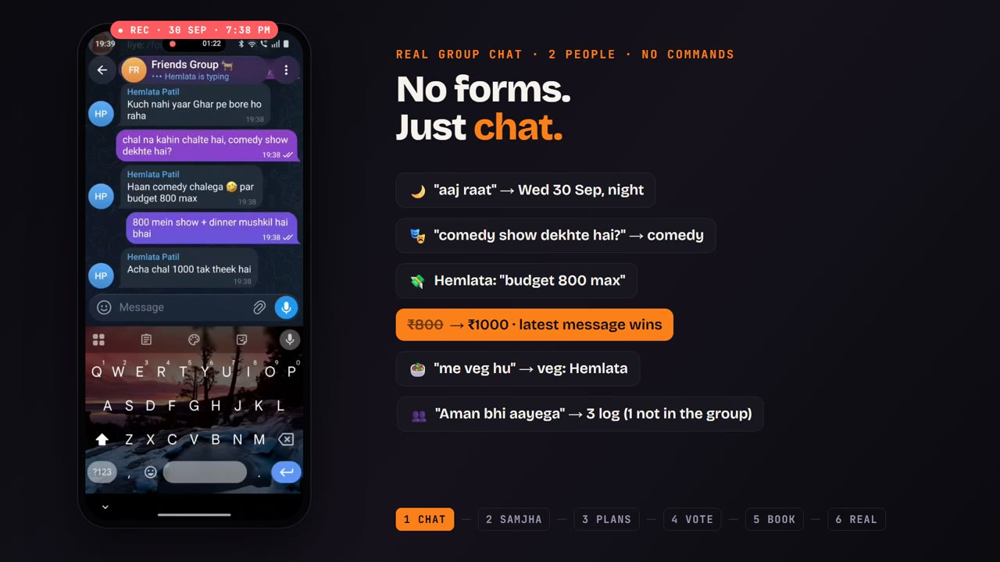
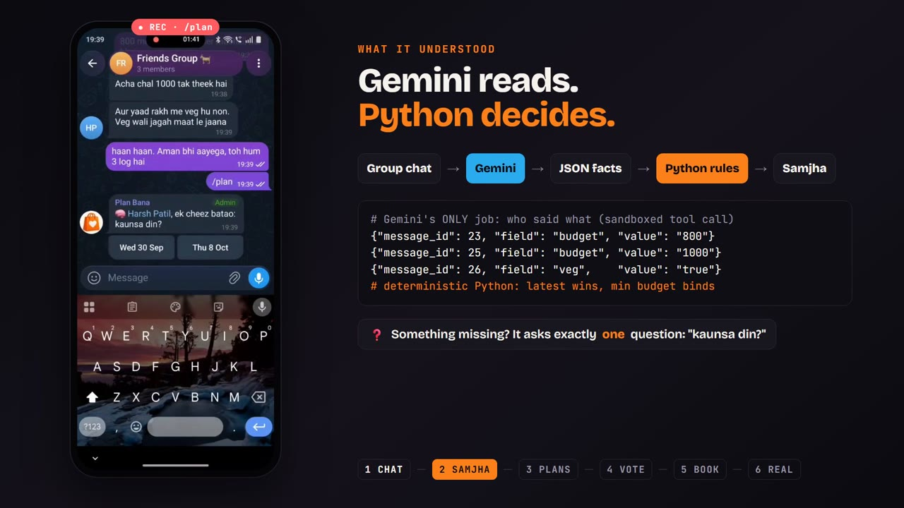
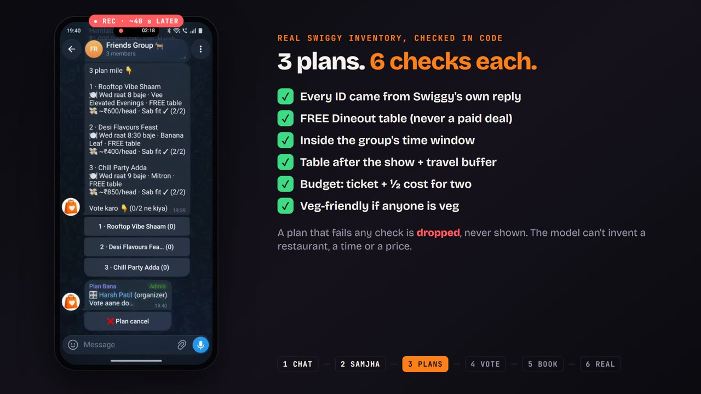
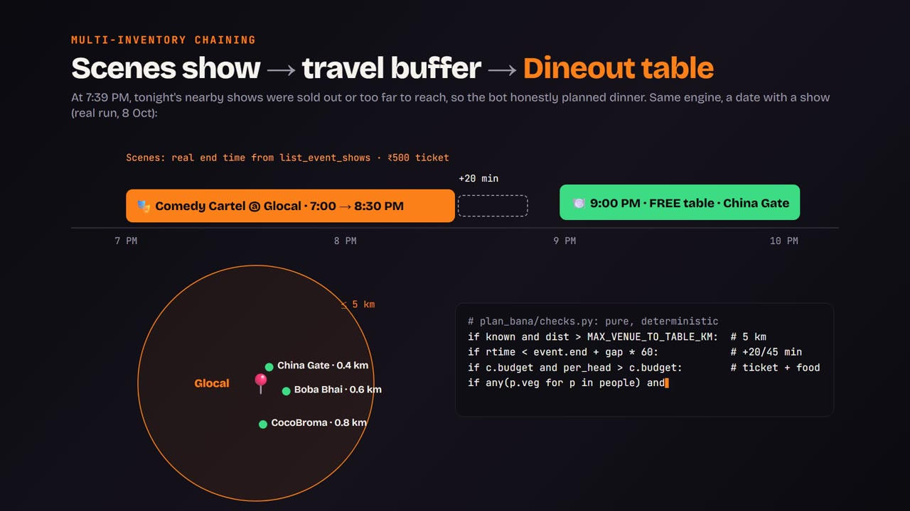
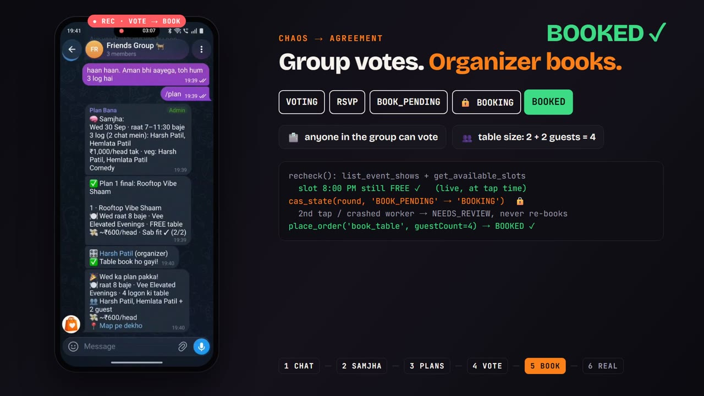
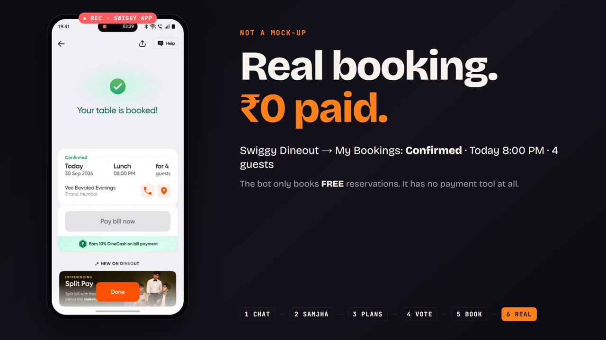
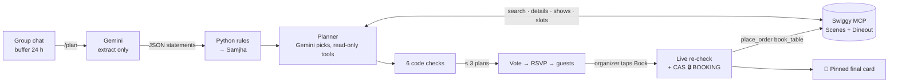
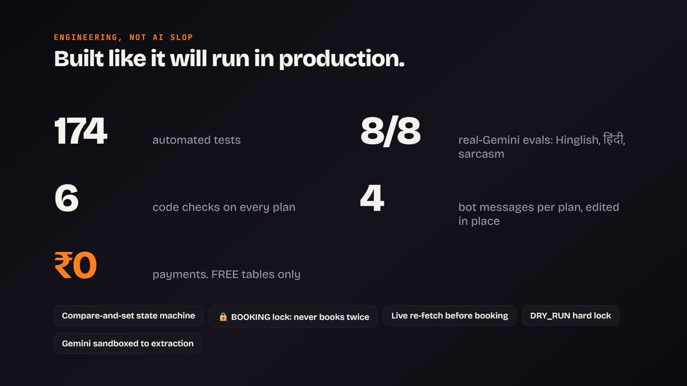

<div align="center">

# Plan Bana 🎉

**Messy group chat in. One decided plan and a booked table out.**

A Telegram bot for friend groups, built on Swiggy's MCP servers: it reads the chat, proposes real **Swiggy Scenes** shows + **FREE Dineout** tables that fit everyone, lets the group vote, and books the table.

[](docs/media/plan-bana-demo.mp4)

**▶ [Watch the 2-minute demo](docs/media/plan-bana-demo.mp4)** · real booking, recorded live on 30 Sep 2026


</div>

---

## The problem

Every food app is built for **one person and a search bar**. Going out is a **group decision**, and it dies in the group chat: fifty messages, zero plans.

Plan Bana sits in that chat, understands it, and turns it into a decision, then into a **real reservation on Swiggy**.

## How it works

<table>
<tr>
<td width="50%"><br><b>1 · Just chat.</b> No forms, no commands. Hinglish, changing minds, half-sentences, all fine.</td>
<td width="50%"><br><b>2 · <code>/plan</code> → 🧠 Samjha.</b> Gemini only extracts <i>who said what</i> as JSON. Deterministic Python decides: latest message wins, lowest budget binds, veg is per person. Missing info → exactly one question.</td>
</tr>
<tr>
<td><br><b>3 · Up to 3 real plans.</b> Every plan passes 6 code checks or it is dropped. The model cannot invent a restaurant, a time or a price.</td>
<td><br><b>4 · Two inventories chained.</b> The show's real end time from Scenes → a travel buffer → a FREE Dineout table within 5 km of the venue.</td>
</tr>
<tr>
<td><br><b>5 · Vote → RSVP → Book.</b> Anyone votes, majority locks, friends say who's coming, the organizer adds guests and taps Book. A live re-check and a compare-and-set lock mean it books exactly once.</td>
<td><br><b>6 · Real.</b> The reservation shows in the Swiggy app and Dineout confirms on WhatsApp. ₹0 paid: the bot only books FREE tables and has no payment tool.</td>
</tr>
</table>

## Why it's built the way it is

| | |
|---|---|
| **Chaos → agreement** | Moves from single-user search to multi-user consensus: extraction, one gap question, voting, RSVP, guests, organizer-only booking. |
| **Multi-inventory chaining** | `list_event_shows` end time + 20/45 min buffer → `get_available_slots` near the venue (≤ 5 km), checked in code. |
| **Engineering over AI slop** | Gemini is sandboxed to one job: Hinglish → JSON statements. Budget, diet, timing, distance and IDs are pure Python checks ([`checks.py`](plan_bana/checks.py)). Model output that cites unknown messages or IDs is dropped. |
| **Production-grade booking** | Compare-and-set state machine; a 🔒 `BOOKING` state means a double tap or a crashed worker goes to `NEEDS_REVIEW` instead of booking twice. The show and slot are re-fetched live at the moment of commitment. |
| **Safe by default** | `DRY_RUN=1` hard lock: booking tools only run through `place_order()`, which refuses unless `DRY_RUN` is exactly `0`. |
| **Group-friendly** | Max 4 new bot messages per plan, edited in place; a single-flight refresher keeps live tallies correct under bursts and Telegram rate limits. `/forget` deletes your messages. |



<details>
<summary><b>Round state machine</b></summary>

```
/plan ─► WAITING_PIN ─pin─► EXTRACTING ─► CONFIRMING (⇄ gap question / Badlo)
       ─► PLANNING ─► VOTING ─lock─► RSVP ─Book─► BOOK_PENDING ─Haan─► re-check ─► 🔒 BOOKING
       ─► BOOKED | TEST_ONLY (DRY_RUN) | FAILED | NEEDS_REVIEW          any time: CANCELLED · EXPIRED
```
Every transition is a compare-and-set on `plan_rounds.state`; every button carries the round id (`<action>:<round8>:<arg>`, ≤ 64 bytes).
</details>

<p align="center"></p>

## Project layout

```
plan_bana/
  rounds.py     the round state machine: Telegram updates in, jobs, CAS transitions
  extract.py    chat → statements (Gemini) → Constraints (pure Python rules)
  planner.py    Gemini tool loop over Scenes + Dineout, deadlines, dinner fallback, Book-time re-check
  checks.py     the 6 deterministic plan checks + per-person fit
  corpus.py     parsers for Swiggy's live response formats
  copy.py       every message the bot sends (Hinglish, IST, compact buttons)
  bot.py        Telegram client (429 retry, HTML, pins) + single-flight message refresher
  db.py         SQLite: chat buffer, rounds, votes, RSVPs, event trail, retention
  store.py      durable per-group job queue with leases
  swiggy.py     MCP client with the DRY_RUN booking lock · auth.py  OAuth 2.1 + PKCE
scripts/        serve_plan (the bot) · try_plan · sim_group · preflight · reset_demo · probe · check_keys
tests/          174 tests: full rounds, planner, checks, parsers on real fixtures + 8 real-Gemini evals
video/          the demo video: Remotion motion graphics + Gemini TTS voice-over
docs/design/    design doc with every review decision (office hours, CEO, eng ×2, design)
```

## Run it

```bash
python -m venv .venv && .venv/Scripts/python -m pip install -e ".[dev]"   # Windows; .venv/bin/python elsewhere
cp .env.example .env                  # Gemini key + Telegram bot token
python scripts/probe.py login         # Swiggy phone + OTP (OAuth 2.1 + PKCE)
python scripts/check_keys.py          # PASS/FAIL per key
pytest -q                             # 174 offline tests
```

Try it without Telegram (real Gemini + real Swiggy, books nothing):
```bash
python scripts/try_plan.py "Rohan: aaj raat comedy?" "Priya: veg hu, 1000 tak"   # extraction + planning
python scripts/sim_group.py                                                     # a whole round, printed
python scripts/preflight.py                                                     # which shows still have seats today
```

Run the bot:
1. In @BotFather: `/setprivacy` → your bot → **Disable** (it must read the group chat), then add it to the group (re-add if it was already there). Making it admin lets it pin the final card.
2. `python scripts/serve_plan.py`
3. In the group: chat, then `/plan`. The first time, the organizer sends a 📍 location pin from their phone.

Commands: `/plan` · `/status` · `/forget` · `/area` · `/debug` (owner only).

> There is no Swiggy sandbox: every call hits production on your own account. With `DRY_RUN=1` (the default) the Book step ends in "🧪 Test mode". With `DRY_RUN=0` it makes a real **FREE** reservation. Cancel it from the Swiggy app, since the MCP has no cancel tool.

## Tests

```bash
pytest -q                          # 174 tests, offline: fake Swiggy in the live response formats + scripted Gemini
RUN_EVALS=1 pytest tests/evals -q  # 8 real-Gemini chats: Hinglish, English, हिंदी, sarcasm, ties, drop-outs
```

<sub>Built by Harsh Patil for Swiggy Builders Club · Swiggy MCP (Scenes, Dineout) · Telegram Bot API · Google Gemini</sub>
